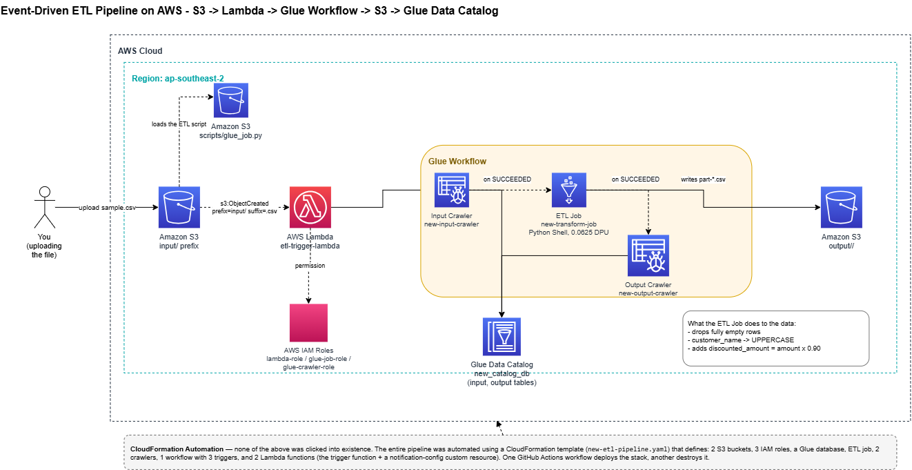
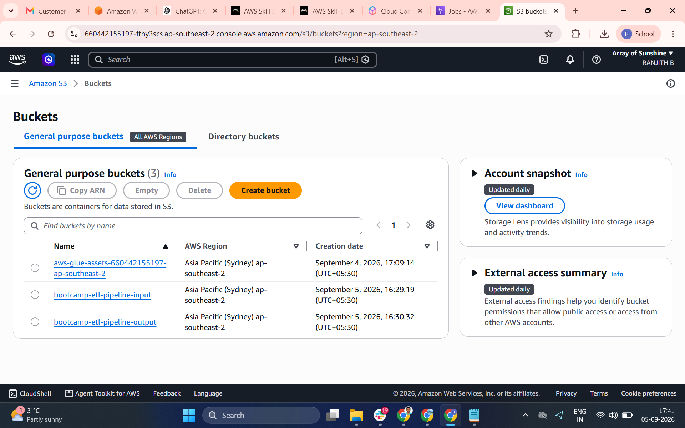
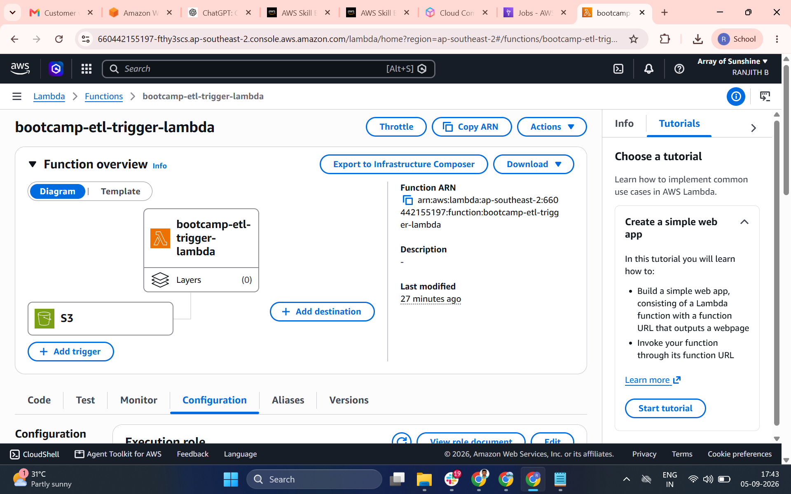
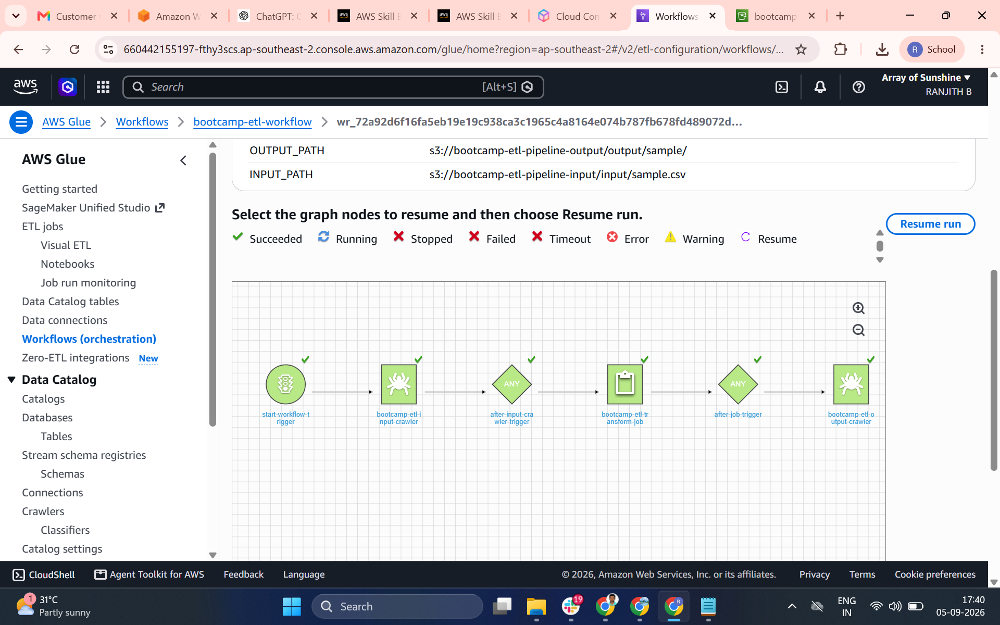
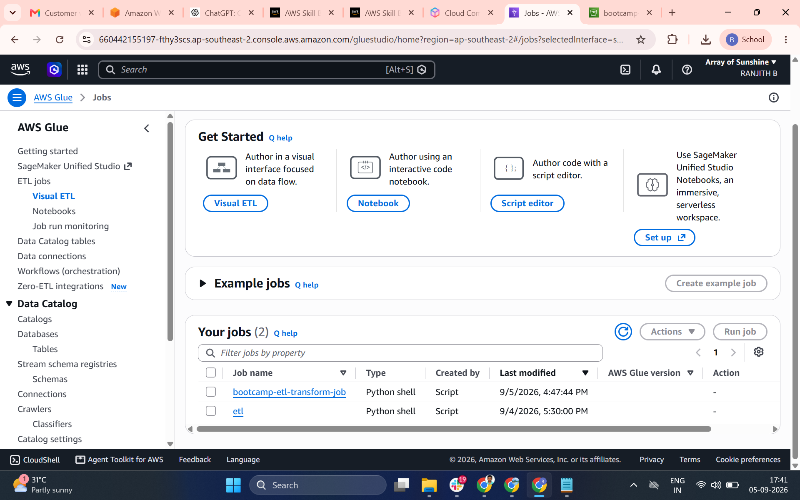
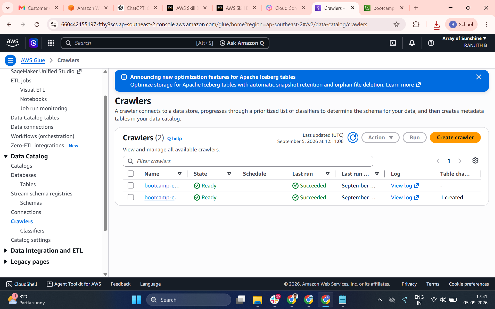
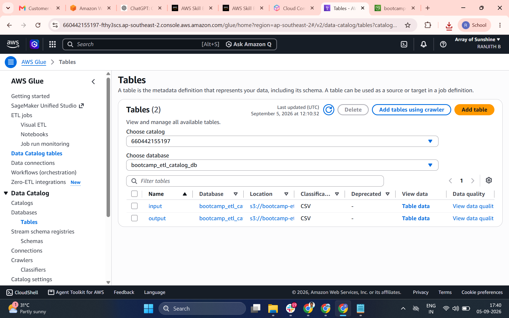
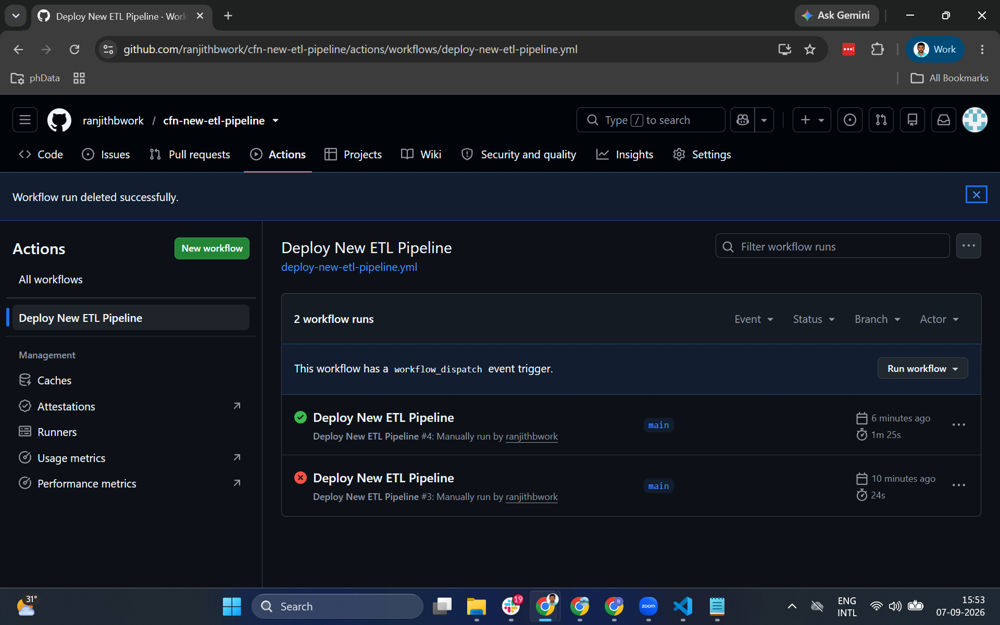
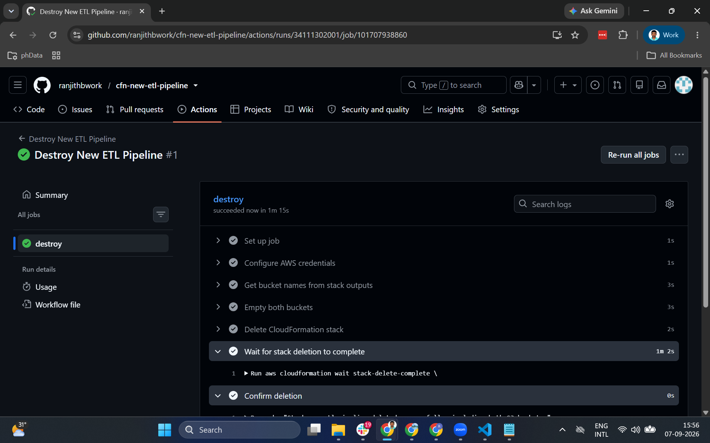

# ETL Pipeline: S3 → Lambda → Glue Workflow → Glue Data Catalog

This repository documents **two implementations** of the same event-driven ETL
pipeline on AWS:

1. **[Manual Build](#1-manual-build)** — every resource created by hand through
   the AWS Console, used to validate the design before automating it.
2. **[CloudFormation / CI-CD Build](#2-cloudformation--cicd-build)** — the same
   architecture, fully codified as a single CloudFormation stack and deployed
   through GitHub Actions.

Both versions implement the same pipeline:

```
Upload CSV → S3 input/
        ↓ (S3 Event Notification)
Lambda (validates file, starts Glue Workflow)
        ↓
Glue Workflow:
   Input Crawler  →  ETL Job (Python Shell)  →  Output Crawler
        ↓
Glue Data Catalog (queryable via Athena)
```

---

## Architecture

```
                            ┌───────────────────────┐
   CSV file ──upload──> │    S3 Input Bucket     │
                         │   (prefix: input/)     │
                         └───────────┬─────────────┘
                                     │ s3:ObjectCreated (*.csv under input/)
                                     ▼
                         ┌───────────────────────┐
                         │    Lambda Function      │
                         │  (validates event,      │
                         │  starts Glue Workflow)   │
                         └───────────┬─────────────┘
                                     │ glue:StartWorkflowRun
                                     ▼
                 ┌───────────────────────────────────────┐
                 │              Glue Workflow              │
                 │                                         │
                 │            ON_DEMAND trigger            │
                 │                   │                     │
                 │                   ▼                     │
                 │      Input Crawler (catalogs input/)    │
                 │                   │  on SUCCEEDED        │
                 │                   ▼                     │
                 │       ETL Job (Python Shell, pandas)     │
                 │           reads input/, writes           │
                 │           output/ to Output Bucket        │
                 │                   │  on SUCCEEDED        │
                 │                   ▼                     │
                 │     Output Crawler (catalogs output/)    │
                 └───────────────────┬───────────────────────┘
                                     │
                    ┌────────────────┴────────────────┐
                    ▼                                  ▼
        ┌───────────────────────┐          ┌───────────────────────┐
        │   S3 Output Bucket     │          │   Glue Data Catalog - verification     │
        │  (prefix: output/)      │          │  (input & output tables,│
        │  written by ETL Job     │          │   queryable via Athena) │
        └───────────────────────┘          └───────────────────────┘
```

---

## Flow

You upload a CSV file into s3://bootcamp-etl-pipeline-input/input/.
S3 detects the new object and fires an s3:ObjectCreated event (filtered to the input/ prefix and .csv suffix).

The event invokes the Lambda function (bootcamp-etl-trigger-lambda).
Lambda validates the event — checks the object is under input/, ends in .csv, and is not empty.
Lambda calls glue.start_workflow_run() on bootcamp-etl-workflow, passing INPUT_PATH and OUTPUT_PATH as workflow run properties.

The workflow's ON_DEMAND trigger fires, starting bootcamp-etl-input-crawler.
The input crawler scans input/, infers the schema, and creates/updates the input table in the Glue Data Catalog (bootcamp_etl_catalog_db).

On crawler success, a CONDITIONAL trigger starts the ETL job, bootcamp-etl-transform-job.
The job resolves its input/output paths by calling glue.get_workflow_run_properties() using the auto-injected WORKFLOW_NAME and WORKFLOW_RUN_ID.

The job reads the CSV from the input bucket using boto3 and pandas.
The job transforms the data — drops fully empty rows, uppercases customer_name, and adds a discounted_amount column (amount × 0.9, rounded).

The job writes the transformed CSV (part-<uuid>.csv) to s3://bootcamp-etl-pipeline-output/output/.
On job success, a second CONDITIONAL trigger starts bootcamp-etl-output-crawler.
The output crawler scans output/, infers the schema, and creates/updates the output table in the same Glue Data Catalog database.

The pipeline is now queryable — both input and output tables exist in bootcamp_etl_catalog_db and can be queried through Athena.

## 1. Manual Build

The first working version of this pipeline was built entirely by hand in the
AWS Console, to validate the design (including how a Python Shell job reads
`INPUT_PATH`/`OUTPUT_PATH` from **Glue Workflow run properties** rather than
plain job arguments) before automating anything.

### Resources created

| Resource                | Name                             |
| ----------------------- | -------------------------------- |
| Region                  | `ap-southeast-2`                 |
| S3 bucket (input)       | `bootcamp-etl-pipeline-input`    |
| S3 bucket (output)      | `bootcamp-etl-pipeline-output`   |
| Glue Database           | `bootcamp_etl_catalog_db`        |
| Glue Crawler (input)    | `bootcamp-etl-input-crawler`     |
| Glue Crawler (output)   | `bootcamp-etl-output-crawler`    |
| Glue ETL Job            | `bootcamp-etl-transform-job`     |
| Glue Workflow           | `bootcamp-etl-workflow`          |
| Lambda function         | `bootcamp-etl-trigger-lambda`    |
| IAM role — Lambda       | `bootcamp-etl-lambda-role`       |
| IAM role — Glue ETL job | `bootcamp-etl-glue-job-role`     |
| IAM role — Glue Crawler | `bootcamp-etl-glue-crawler-role` |

### IAM — least privilege

Three separate roles were created, each scoped only to what that service
actually needs:

- **Lambda role** — only `glue:StartWorkflowRun`, scoped to the one workflow ARN.
  Lambda never touches S3 directly; the S3 event payload already contains the
  bucket/key it needs.
- **Glue Job role** — `s3:GetObject`/`s3:ListBucket` scoped to `input/` and
  `scripts/` prefixes only, `s3:PutObject` scoped to `output/` only, plus
  `glue:GetWorkflowRunProperties`/`GetWorkflowRun` (required for the job to
  read `INPUT_PATH`/`OUTPUT_PATH` at runtime).
- **Glue Crawler role** — read-only `s3:GetObject`/`s3:ListBucket` on both
  buckets' relevant prefixes. Crawlers never write to S3.

Each role also carries the AWS-managed `AWSGlueServiceRole` /
`AWSLambdaBasicExecutionRole` policy for basic service logging.

### Execution flow

1. A `.csv` file is uploaded to `s3://bootcamp-etl-pipeline-input/input/`.
2. The bucket's event notification (filtered to `input/` prefix, `.csv`
   suffix) invokes `bootcamp-etl-trigger-lambda`.
3. Lambda validates the event (non-empty, correct prefix/suffix) and calls
   `glue.start_workflow_run()`, passing `INPUT_PATH` and `OUTPUT_PATH` as
   **workflow run properties**.
4. The workflow's `ON_DEMAND` trigger starts `bootcamp-etl-input-crawler`,
   which catalogs the raw input schema.
5. On crawler success, a `CONDITIONAL` trigger starts
   `bootcamp-etl-transform-job`. The Python Shell script:
   - Reads `WORKFLOW_NAME`/`WORKFLOW_RUN_ID` (auto-injected by Glue).
   - Calls `get_workflow_run_properties()` to resolve `INPUT_PATH`/`OUTPUT_PATH`.
   - Loads the CSV with pandas, drops empty rows, uppercases `customer_name`,
     adds a `discounted_amount` column (`amount * 0.9`, rounded).
   - Writes `part-<uuid>.csv` to the output prefix.
6. On job success, a second `CONDITIONAL` trigger starts
   `bootcamp-etl-output-crawler`, cataloging the transformed output.
7. The Glue Data Catalog now has two tables (`input`, `output`) under
   `bootcamp_etl_catalog_db`, queryable via Athena.

### Setup (manual)

1. Created two S3 buckets — bootcamp-etl-pipeline-input and bootcamp-etl-pipeline-output — both with SSE-S3 encryption, public access fully blocked, and versioning disabled.
2. Set up the folder structure inside them: input/ and scripts/ in the input bucket, output/ in the output bucket.
3. Created three separate IAM roles, each scoped to only what it needed: bootcamp-etl-glue-job-role (read input/+scripts/, write output/, plus glue:GetWorkflowRunProperties), bootcamp-etl-glue-crawler-role (read-only on both buckets), and bootcamp-etl-lambda-role (only glue:StartWorkflowRun, scoped to the one workflow).
4. Created the Glue Data Catalog database, bootcamp_etl_catalog_db.
5. Wrote glue_job.py — a Python Shell script that reads WORKFLOW_NAME/WORKFLOW_RUN_ID (auto-injected by Glue when running inside a workflow), fetches INPUT_PATH/OUTPUT_PATH via get_workflow_run_properties(), transforms the CSV with pandas, and writes the result back to S3 — uploaded to s3://bootcamp-etl-pipeline-input/scripts/glue_job.py.
6. Created the Glue ETL Job, bootcamp-etl-transform-job, as a Python Shell job on the smallest DPU size (0.0625), with a 10-minute timeout and retries disabled, pointing at the uploaded script.
7. Created two crawlers — bootcamp-etl-input-crawler targeting input/ and bootcamp-etl-output-crawler targeting output/ — both writing into the shared catalog database, both set to run on-demand only.
8. Created the Glue Workflow, bootcamp-etl-workflow, and built the trigger chain inside it: an ON_DEMAND start trigger running the input crawler, a conditional trigger firing the ETL job when the input crawler succeeds, and a second conditional trigger firing the output crawler when the job succeeds.
9. Created the Lambda function, bootcamp-etl-trigger-lambda, set its GLUE_WORKFLOW_NAME environment variable, and deployed the code that validates the incoming S3 event and calls start_workflow_run().
10. Wired an S3 event notification on the input bucket (filtered to the input/ prefix and .csv suffix) pointing at the Lambda function, letting S3 invoke it directly.
11. Tested the whole thing by uploading a CSV to input/ and watching the workflow run automatically end-to-end — crawler, then job, then crawler — confirming the output CSV appeared correctly transformed and both tables showed up in the Data Catalog.

### Cost controls

- Glue Job runs on the smallest Python Shell size (0.0625 DPU), timeout
  capped at 10 minutes, retries disabled.
- Crawlers run on-demand only (no schedule).

---

## 2. CloudFormation / CI-CD Build

Once the manual build was verified working end-to-end, the entire pipeline
was recreated as a **single CloudFormation stack**, deployed and destroyed
through a GitHub Actions workflow — no manual console steps required.

### Repository layout

```
├── new-etl-pipeline.yaml                       # the CloudFormation template
├── glue/
│   └── glue_job.py                             # ETL transform script
├── sample-data/
│   └── sample.csv                               # sample input for testing
├── .github/workflows/
│   ├── deploy-new-etl-pipeline.yml              # deploy workflow
│   └── destroy-new-etl-pipeline.yml             # teardown workflow
└── docs/
    └── screenshots/                              # architecture + run evidence
```

### Resources created (via CloudFormation)

| Resource                | Name                               |
| ----------------------- | ---------------------------------- |
| Region                  | `ap-southeast-2`                   |
| CloudFormation stack    | `new-etl-pipeline`                 |
| S3 bucket (input)       | `new-pipeline-input-<account-id>`  |
| S3 bucket (output)      | `new-pipeline-output-<account-id>` |
| Glue Database           | `new_catalog_db`                   |
| Glue Crawler (input)    | `new-input-crawler`                |
| Glue Crawler (output)   | `new-output-crawler`               |
| Glue ETL Job            | `new-transform-job`                |
| Glue Workflow           | `new-workflow`                     |
| Lambda function         | `new-trigger-lambda`               |
| IAM role — Lambda       | `new-lambda-role`                  |
| IAM role — Glue ETL job | `new-glue-job-role`                |
| IAM role — Glue Crawler | `new-glue-crawler-role`            |

S3 bucket names include the AWS account ID as a suffix to guarantee global
uniqueness (S3 bucket names are unique across _all_ AWS accounts worldwide,
not just your own).

### Execution flow (identical pipeline logic to the manual build)

1. GitHub Actions runs `aws cloudformation deploy`, creating all resources in
   one stack: both buckets, three IAM roles, the Glue database/job/crawlers/
   workflow/triggers, the trigger Lambda, the notification-config Lambda, and
   the custom resource that wires the S3 event notification.
2. The workflow then uploads `glue/glue_job.py` to the new input bucket's
   `scripts/` prefix, and `sample-data/sample.csv` to `input/` — the latter
   immediately fires the real S3 → Lambda → Workflow chain, exactly as in the
   manual build.
3. From this point, the pipeline behaves identically to the manual version:
   crawler → job → crawler → catalog.

### Deploying

1. Add three GitHub Secrets to the repository: `AWS_ACCESS_KEY_ID`,
   `AWS_SECRET_ACCESS_KEY`, `AWS_REGION`.
2. Go to **Actions → Deploy New ETL Pipeline → Run workflow**.
3. The workflow validates the template, deploys the stack, uploads the Glue
   script and a sample CSV, and prints the stack's outputs (bucket names,
   Lambda ARN, workflow name).

### Destroying

1. Go to **Actions → Destroy New ETL Pipeline → Run workflow**.
2. The workflow empties both S3 buckets (CloudFormation cannot delete
   non-empty buckets), deletes the stack, and waits for deletion to complete
   — removing every resource the stack created.

### Cost controls

Identical to the manual build: smallest Glue Python Shell size, short
timeout, no retries, on-demand crawlers only, S3 lifecycle rule for
incomplete multipart uploads, and nothing left running between triggered
invocations. Because the entire stack can be destroyed and redeployed with a
single button press, there is no reason to leave any of these resources
running when not actively testing.

## Screenshots

The Naming convention of resources in manual and Cloudformation automation is different. the screenshots include resources created in manual way and the deployment and destroying actions in github for automation

## Draw.io



## Buckets



## Lambda



## Glue Workflow



## Glue Jobs



## Crawlers



## Catalog Tables



## Deploy using github actions



## Destroy using github actions


